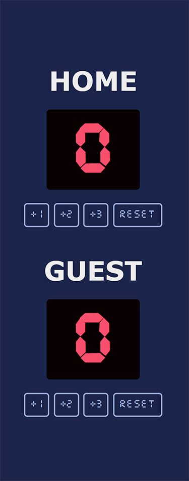
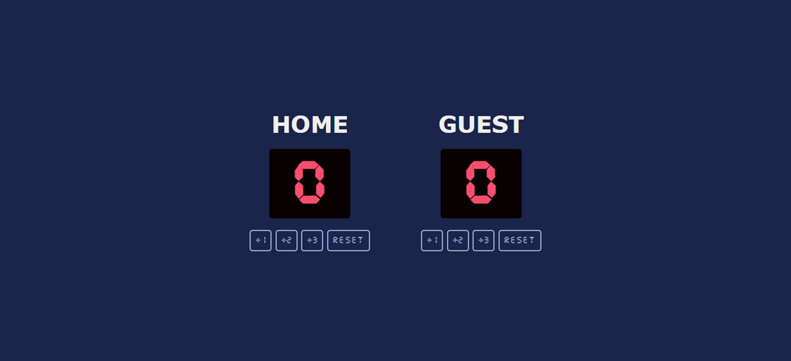

# Basketball Scoreboard - Solo Project

## Table of contents

- [Figma Design](#figma-design)
- [Overview](#overview)
  - [Screenshot](#screenshot)
  - [Links](#links)
- [My Process](#my-process)
  - [Languages and Tools](#languages-and-tools)
  - [Built With](#built-with)
  - [What I Learnt](#what-i-learnt)
  - [Useful Resources](#useful-resources)
- [Author](#author)

## Figma Design

- [Basketball Scoreboard Design File](https://www.figma.com/file/YC48MCx4frBFtYoz6rNJE6/Basketball-Scoreboard?node-id=0%3A1)

## Overview

### Screenshot

#### Mobile

#### Desktop

### Links

- [Live 🔗](https://iqra0001.github.io/Basketball-Scoreboard/)

## My process

### Languages and Tools

- HTML5
- CSS3
- JavaScript
- Sublime Text 3

### Built With

- Desktop first workflow
- Semantic HTML5 markup
- Custom CSS Properties
- CSS Flexbox
- Vanilla JavaScript

### What I Learnt

- Design to code conversion
- Understood CSS Flexbox better
- Used the Number() method to convert the variables to numbers

### Useful Resources

- [JavaScript Number Methods](https://www.w3schools.com/js/js_number_methods.asp)

### Acknowledgements

- [Scrimba](https://scrimba.com)

## Author

- LinkedIn - [Iqra Zaheer](https://www.linkedin.com/in/iqra-zaheer-45bb42231/)
- Github - [@iqra0001](https://github.com/iqra0001)
- Frontend Mentor - [@iqra0001](https://www.frontendmentor.io/profile/iqra0001)
- Instagram - [Iqra Zaheer](https://www.instagram.com/iqraaa0001/)
